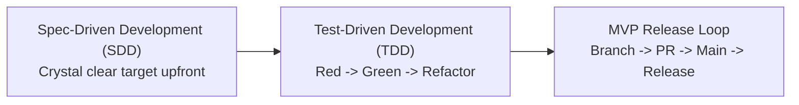
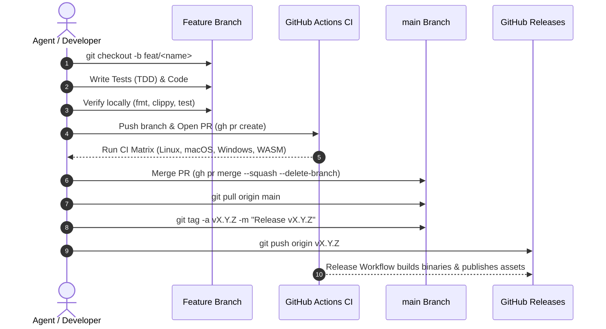

# AGENTS.md — Agentic Engineering Guidelines & Workflow

> **Kestrel-PDF**: Ultra-High-Performance, Universal PDF Reader & Editor for Windows, macOS, Linux, FreeBSD & WebAssembly.
> Built with **Rust**, **egui (`eframe` + `wgpu`)**, **PDFium**, and **lopdf**.

---

## 1. Core Engineering Philosophy

All AI agents operating in this repository must adhere to three foundational pillars:



### Pillar 1: Spec-Driven Development (SDD)
- **Target Clarity**: Never write production code without an explicit specification, defined requirements, clear input/output contracts, error conditions, and acceptance criteria.
- **Specification Documentation**: High-level designs and architectural decisions must be committed to `docs/architecture/`. Feature implementation plans and specifications must be committed to `docs/plans/`.
- **Zero Ambiguity**: Resolve architectural ambiguities or user intent before diving into implementation.

### Pillar 2: Test-Driven Development (TDD)
- **Red $\to$ Green $\to$ Refactor**:
  1. **Red**: Write a failing test that exercises the expected behavior or reproduces a reported bug.
  2. **Green**: Implement the minimal, clean code required to make the test pass.
  3. **Refactor**: Clean up, eliminate warnings, format with `cargo fmt`, and optimize.
- **Testing Trophy**:
  - **Unit Tests** (`crates/*/src/`): Pure algorithms, math transformations, Bézier splines, hash collision handling.
  - **Integration Tests** (`crates/kestrel-core/tests/`): Document sessions, AST manipulation, multi-filter decompression, AcroForms roundtrip, search, redactions.
  - **E2E Smoke Tests** (`crates/kestrel-app/tests/`): Full UI application state, simulated frame rendering, tool switching, rotation, zooming, title bar display.
- **Synthetic Data Over External Binaries**:
  - Never depend on unversioned or external files on disk for core testing.
  - Use `kestrel_core::synthetic::SyntheticPdfBuilder` to generate valid, reproducible PDF 1.7 documents in memory (visual showcases, forms, search corpora).

### Pillar 3: "Fail Fast, Fix Fast" (MVP Release Loop)
- Keep feedback loops tight. Do not overcomplicate the development cycle with long-lived integration branches or complex Git-flow during the MVP phase.
- Validate every change against the cross-platform CI matrix immediately.

---

## 2. Git, Branching & Release Lifecycle

Every feature, fix, documentation update, or refactor must strictly follow this lifecycle:



### Step-by-Step Execution Rules

1. **Dedicated Branch**:
   - Always create a branch from latest `main`:
     ```bash
     git checkout main && git pull origin main
     git checkout -b <type>/<short-description>
     ```
   - Standard prefixes:
     - `feat/`: New capabilities or enhancements.
     - `fix/`: Bug fixes, rendering corrections, crash resolutions.
     - `test/`: New synthetic tests, integration suites, benchmarks.
     - `docs/`: Documentation, ADRs, plans, handoffs.
     - `chore/`: Dependency bumps, CI updates, version bumps.

2. **Local Pre-Flight Checks**:
   - Before pushing, always run the full verification battery:
     ```bash
     cargo fmt --all -- --check
     cargo clippy --workspace --all-targets -- -D warnings
     cargo test --workspace
     cargo check -p kestrel-app --target wasm32-unknown-unknown
     ```
   - Code must compile with **zero warnings** and **zero formatting errors**.

3. **Pull Request Submission**:
   - Push branch to remote:
     ```bash
     git push -u origin <branch-name>
     ```
   - Create PR using non-interactive `gh` CLI with a markdown body file:
     ```bash
     gh pr create --base main --head <branch-name> --title "..." --body-file /tmp/pr_body.md
     ```

4. **CI Verification**:
   - Check status without blocking or polling loops:
     ```bash
     gh pr checks <PR_NUMBER> --watch=false
     ```
   - All 8 matrix checks must pass:
     - Lint & Formatting
     - Integration Tests (ubuntu-latest, macos-latest, windows-latest)
     - E2E Smoke Tests (ubuntu-latest, macos-latest, windows-latest)
     - WebAssembly Build Check

5. **Merge to `main`**:
   - Merge cleanly into `main`:
     ```bash
     gh pr merge <PR_NUMBER> --squash --delete-branch
     ```

6. **Tagging & Official Release**:
   - Switch back to `main` and pull the merged commit:
     ```bash
     git checkout main && git pull origin main
     ```
   - Create an annotated tag and push it:
     ```bash
     git tag -a vX.Y.Z -m "Release vX.Y.Z: <Highlights>"
     git push origin vX.Y.Z
     ```
   - This triggers `.github/workflows/release.yml`, building native release binaries:
     - `kestrel-pdf-windows-x64.exe` (Windows x64 MSVC)
     - `kestrel-pdf-macos-arm64` (macOS Apple Silicon)
     - `kestrel-pdf-linux-x64` (Linux x64 GNU)
   - Monitor the run via `gh run view <RUN_ID>` and confirm the GitHub Release is published.

---

## 3. Documentation Governance (`docs/`)

All project documentation must be written in **English** and structured across three dedicated directories:

```
docs/
├── architecture/      # System architecture & Architecture Decision Records (ADRs)
│   ├── README.md      # Index of ADRs and ADR template
│   ├── 0001-system-overview.md
│   ├── 0002-engine-investigation.md
│   ├── 0003-cicd-and-testing-trophy.md
│   └── 0004-synthetic-engine-and-visual-pipeline.md
├── plans/             # Implementation plans & Spec-Driven Development specs
│   ├── README.md      # Index of plans and plan template
│   ├── 0001-mvp-roadmap.md
│   └── 0002-spec-driven-development-framework.md
└── handoffs/          # Inter-session agent handoff logs
    ├── README.md      # Index of handoffs and handoff template
    └── 0001-v0.2.4-synthetic-suite-and-release.md
```

### Directory Roles

| Directory | Purpose | Naming Format |
| :--- | :--- | :--- |
| `docs/architecture/` | Decisions on subsystems, thread models, memory virtualization, AST parsers, libraries, and trade-offs. | `NNNN-<topic-slug>.md` |
| `docs/plans/` | Specifications, user journeys, acceptance criteria, implementation phases, and test strategies for upcoming features. | `NNNN-<feature-slug>.md` |
| `docs/handoffs/` | Snapshot of repository status at the conclusion of an agent session: merged PRs, active version, test count, blockers, and next tasks. | `NNNN-<context-slug>.md` |

---

## 4. GitHub CLI Non-Interactive Operational Rules

When interacting with GitHub via the terminal (`run_command`):

1. **CLI Priority**: Always use `gh` CLI instead of MCP tools by default. Fall back to GitHub MCP server only if CLI fails and cannot be fixed by flags.
2. **Strictly Non-Interactive**:
   - Never trigger interactive prompts (`--yes` where required).
   - Never open text editors (e.g. Vim, Nano). Always pass explicit `--title`, `--body-file`, `--base`, `--head`.
   - Ensure pagers are disabled (`PAGER=cat` is automatically set).
3. **Token Conservation & Output Pruning**:
   - Never execute unbounded listings (`gh pr list`, `gh issue list`, `gh run list`).
   - Always supply `--limit` (3 to 10) and extract only required fields via `--json`.
4. **Safe Multi-Line Text Handling**:
   - Never inline complex multiline markdown directly into `-b "..."`.
   - Write markdown descriptions to `/tmp/gh_body.md`, pass `--body-file /tmp/gh_body.md`, and clean up afterwards.
5. **Diffs and Checks**:
   - Check changed files with `gh pr diff <PR> --name-only` before inspecting diffs.
   - Run checks with `--watch=false` to avoid blocking executions.

---

## 5. Coding Standards & Rust Guidelines

- **Compiler Lints**: `#![deny(warnings)]` clean. All code must pass `cargo clippy --workspace --all-targets -- -D warnings`.
- **Formatting**: Strictly follow standard `rustfmt` via `cargo fmt --all -- --check`.
- **Error Handling**: Use `anyhow` or `thiserror` for recoverable errors. Never panic (`unwrap()`, `expect()`) in production rendering or UI loops; bubble errors gracefully with UI fallbacks.
- **Cross-Platform Compatibility**:
  - No platform-specific hardcoded paths (use `std::path::PathBuf`).
  - Ensure compatibility with `wasm32-unknown-unknown` by conditionally guarding desktop-only crates or features (`cfg(target_arch = "wasm32")`).
  - Maintain support for Windows MSVC (avoid non-portable C/C++ dependencies).
- **Communication Standards**:
  - Always link referenced code files, structs, and tests using clickable GitHub-style links (`file:///...`).
  - Write concise, objective status updates and documentation in English.
