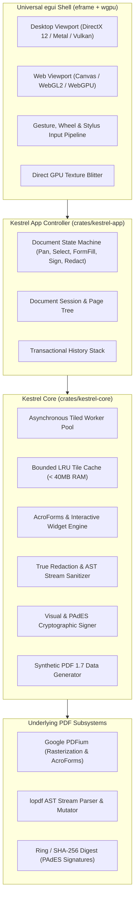

# Kestrel-PDF

<div align="center">

[](https://github.com/aitordiaz/kestrel-pdf/actions/workflows/ci.yml)
[](https://github.com/aitordiaz/kestrel-pdf/releases)
[](LICENSE)
[](https://www.rust-lang.org)
[]()

**Ultra-High-Performance, Universal PDF Reader & Editor**  
*Engineered from the ground up in Rust for instantaneous startup, 120 FPS navigation, in-place editing, and true data sanitization.*

[Downloads](#-download--releases) • [Architecture](docs/architecture/README.md) • [Roadmap](docs/plans/README.md) • [Agentic Guidelines](AGENTS.md) • [Getting Started](#-getting-started)

</div>

---

## ⚡ Why Kestrel-PDF?

Most existing PDF viewers either suffer from massive memory overhead (Electron or browser-based readers consuming 400MB–1GB+ RAM), viral copyleft licenses (GPL/AGPL), or lack native cross-platform support.

**Kestrel-PDF** solves this with a **strictly decoupled engine architecture** written in **Rust** with **egui (`eframe` + `wgpu`)**:
- 🚀 **Sub-100ms Cold Startup**: Memory-mapped (`mmap`) byte loading.
- 🎯 **Bounded Memory Footprint**: Strictly constrained LRU tile cache ($\le 40\text{ MB}$ RAM footprint even on 10,000-page blueprints).
- 🔄 **4-Quadrant Orientation**: Native handling of 0°, 90°, 180°, and 270° orientations with on-the-fly dynamic page rotation controls (`⟲`, `⟳`).
- 🔍 **Fluid Zoom & Responsive Fitting**: Smooth zooming (10% to 500%), Fit Width, and Fit Page adapting to arbitrary display viewports.
- 📝 **Interactive AcroForms**: Fill text fields, toggle checkboxes, and select dropdown choices with verified roundtrip PDF serialization.
- ✍️ **Contract Signing**: Smooth cubic Bézier stylus/mouse signatures and legally binding cryptographic PAdES SHA-256 digests.
- 🔎 **Full-Text Search**: Case-insensitive multi-page search with real-time on-canvas visual highlight bounding boxes.
- 🛡️ **True Cryptographic Redaction**: Structural AST sanitization stripping sensitive glyph operators (`Tj`, `TJ`), zeroing out raster pixels, and purging metadata.
- 🌐 **Single Universal Codebase**: Compiles natively to Windows (Direct3D 12), macOS (Metal), Linux/FreeBSD (Vulkan/OpenGL), and browsers (WebAssembly via WebGL2/WebGPU).

---

## 🤖 Agentic Engineering: Spec-Driven & Test-Driven Development

Kestrel-PDF is developed following a rigorous agentic methodology documented in **[`AGENTS.md`](AGENTS.md)**:

1. **Spec-Driven Development (SDD)**: Every feature, bug fix, or refactor begins with a concrete specification in `docs/plans/` defining explicit input/output contracts, edge cases, and acceptance criteria before writing code.
2. **Test-Driven Development (TDD)**: Implementation follows the Red $\to$ Green $\to$ Refactor cycle using our comprehensive Testing Trophy.
3. **In-Memory Synthetic Data Generation**: Tests do not rely on flaky, uncommitted binary files on disk. The engine provides `SyntheticPdfBuilder` (`crates/kestrel-core/src/synthetic.rs`) to generate reproducible PDF 1.7 documents directly in RAM.
4. **"Fail Fast, Fix Fast" MVP Release Loop**:
   - Each task is isolated in a dedicated branch (`feat/*`, `fix/*`, `test/*`, `docs/*`).
   - Pull Requests are validated non-interactively across an 8-check cross-platform CI matrix.
   - Merges into `main` automatically produce annotated tags and GitHub Releases with compiled binaries.

### Structured Documentation Hub (`docs/`)

- **[docs/architecture/](docs/architecture/README.md)**: Architecture Decision Records (ADRs), system designs, benchmark studies, and memory virtualization specifications.
- **[docs/plans/](docs/plans/README.md)**: Implementation plans, phased roadmaps, and SDD specifications.
- **[docs/handoffs/](docs/handoffs/README.md)**: Agent handoff records preserving complete inter-session context, test coverage metrics, and open tasks.

---

## 🏆 Testing Trophy Suite (28 Tests Across Workspace)

Kestrel-PDF enforces a robust multi-tiered testing battery verified on Linux, macOS, and Windows runners:

```
            /  End-to-End Smoke Tests (12 tests)  \   <- kestrel-app (Headless UI frames, zoom, rotation, forms, search)
           /---------------------------------------\
          /      Integration Tests (16 tests)       \  <- kestrel-core (Synthetic showcase, PAdES, AcroForms, LRU cache)
         /-------------------------------------------\
        /             Unit Tests & Math               \ <- Splines, coordinates, UTF-8 strings
       /-----------------------------------------------\
      /            Static Analysis & Lints              \ <- rustfmt, clippy (-D warnings), cargo check wasm32
     /---------------------------------------------------\
```

Run the entire suite locally:
```bash
cargo test --workspace
```

---

## 📦 Download & Releases

Pre-compiled, standalone release binaries are available on the [GitHub Releases Page](https://github.com/aitordiaz/kestrel-pdf/releases):

| Platform | Target Architecture | Binary Asset | Status |
| :--- | :--- | :--- | :--- |
| **Windows** | x86_64 MSVC | [`kestrel-pdf-windows-x64.exe`](https://github.com/aitordiaz/kestrel-pdf/releases/latest) | ✅ Ready |
| **macOS** | Apple Silicon ARM64 | [`kestrel-pdf-macos-arm64`](https://github.com/aitordiaz/kestrel-pdf/releases/latest) | ✅ Ready |
| **Linux** | x86_64 GNU | [`kestrel-pdf-linux-x64`](https://github.com/aitordiaz/kestrel-pdf/releases/latest) | ✅ Ready |
| **Web** | WebAssembly | `wasm32-unknown-unknown` | 🧪 CI Verified |

---

## 🛠️ Getting Started

### Prerequisites

- **Rust**: Stable toolchain (1.80+) installed via [rustup](https://rustup.rs).
- **C/C++ Build Tools**: Required for native PDFium binding on desktop platforms (MSVC on Windows, Xcode on macOS, GCC/Clang on Linux).

### Running the Application

```bash
# Clone the repository
git clone https://github.com/aitordiaz/kestrel-pdf.git
cd kestrel-pdf

# Run native desktop viewer
cargo run -p kestrel-app
```

### Verification & Quality Gates

```bash
# Check code formatting
cargo fmt --all -- --check

# Deny compiler warnings and run lints
cargo clippy --workspace --all-targets -- -D warnings

# Execute the 28-test integration and E2E battery
cargo test --workspace

# Validate WebAssembly target compilation
cargo check -p kestrel-app --target wasm32-unknown-unknown
```

---

## 🏛️ System Architecture



---

## 📄 License

Licensed under either of:

- Apache License, Version 2.0 ([LICENSE-APACHE](http://www.apache.org/licenses/LICENSE-2.0))
- MIT license ([LICENSE-MIT](http://opensource.org/licenses/MIT))

at your option.
