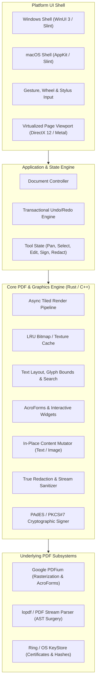
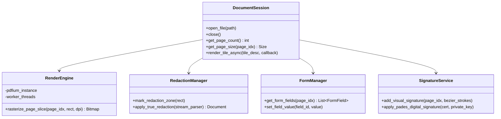

# Velox-PDF: Architecture Specification

## 1. High-Level Architecture Overview

Velox-PDF is designed with a **Strictly Decoupled Core-to-UI Architecture**. The performance-critical engine is completely isolated from the platform UI shell.

---

## 2. Core Performance Design Principles

To be the **most performant PDF reader on Windows and macOS**, Velox-PDF implements four architectural pillars:

### A. Asynchronous, Tiled Viewport Rendering
- **Main Thread Never Blocks**: The UI thread only manages input events (scroll, zoom, click) and blits cached GPU textures.
- **Priority-Based Worker Pool**: Page rasterization requests are dispatched to a multi-threaded worker thread pool.
  - Priority 1: Currently visible viewport area at current DPI.
  - Priority 2: 1-2 pages above and below the current viewport (predictive prefetch).
  - Priority 3: Thumbnails and outline navigation.
- **Tiled Decomposition**: Large pages (e.g. A0 blueprints or CAD drawings) are subdivided into $512 \times 512$ pixel tiles. Only tiles intersecting the active viewport are rasterized, preventing out-of-memory crashes.

### B. Bounded LRU Cache & Virtualized Memory
- Even when viewing a 10,000-page PDF, memory usage remains bounded ($< 60\text{ MB}$ footprint).
- As pages scroll out of the predictive window, their rasterized bitmaps are evicted from the LRU cache. The raw PDF file is memory-mapped (`mmap`), loading byte slices on-demand.

### C. True Redaction Engine vs. Superficial Masking
Most basic PDF tools perform "pseudo-redaction" by simply painting a black rectangle annotation over sensitive content. The underlying text remains in the content stream, easily extracted by copying or inspecting the file.

Velox-PDF enforces **Cryptographic & Structural True Redaction**:
1. **Content Stream Parsing**: Decompresses the page content stream (`/Filter /FlateDecode`).
2. **Text Operator Stripping**: Identifies text showing operators (`Tj`, `TJ`, `'`, `"`) whose bounding boxes intersect the redaction polygon. The operators and glyph indexes are surgically excised or replaced with sanitized spaces.
3. **Raster Image Scrubbing**: If an image intersects the redaction box, the underlying image pixels are permanently zeroed out in the raster stream; if fully enclosed, the image XObject dictionary is unlinked.
4. **Metadata Sanitization**: Removes document author, edit history, XML metadata packets (`/Metadata`), and deleted object references from the cross-reference (`xref`) table.

### D. Digital Signatures & Form Filling
- **Forms**: Direct two-way binding with PDFium's AcroForm subsystem.
- **Signing**:
  - *Visual*: Smooth cubic Bézier stroke interpolation with pressure sensitivity for stylus and mouse signatures.
  - *Digital (PAdES)*: Signs the PDF byte range using standard PKCS#7 / CMS cryptographic envelopes, embedding the X.509 certificate and SHA-256 hash without breaking document validity.

---

## 3. Technology Stack Selection

### Language Recommendation: **Rust (Engine Core) + Slint / Native UI**
- **Why Rust over pure C++**:
  1. **Memory Safety & Exploit Prevention**: PDF parsers handle arbitrary untrusted user files. C++ parsers have suffered from decades of buffer overruns and use-after-free vulnerabilities. Rust prevents these at compile time.
  2. **Fearless Concurrency**: Managing multi-threaded tile caches and asynchronous render queues without data races is trivial in Rust (`crossbeam`, `rayon`, `tokio`).
  3. **Zero Runtime Overhead**: Compiles to LLVM native machine code; identical microsecond performance to C++.
- **GUI Layer Options**:
  - **Option 1 (Recommended)**: **Slint (Rust)**: Compiles to native code, hardware-accelerated backends (Direct3D on Windows, Metal on macOS), ultra-low memory footprint (< 15MB base), 60+ FPS rendering.
  - **Option 2**: **Rust Core with C-ABI FFI + Platform-Native Shells** (WinUI 3 via C++/WinRT for Windows, Swift/AppKit for macOS). Maximum native OS look-and-feel.
  - **Option 3**: **C++20 + Qt 6**. Industry standard for Sioyek/Okular, but heavy runtime DLL distribution and LGPL licensing constraints.

---

## 4. Subsystem Class & Module Contracts

