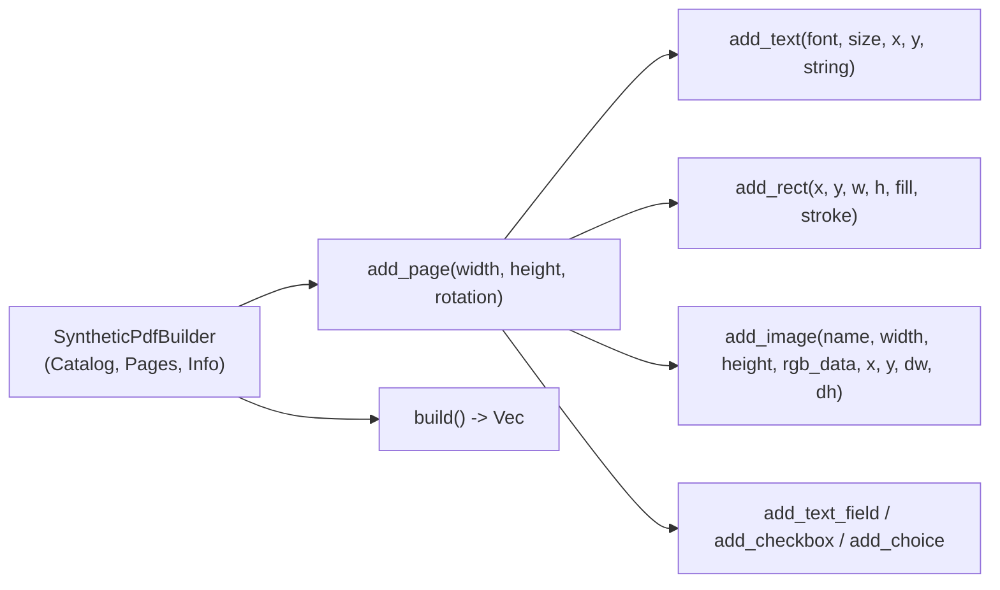
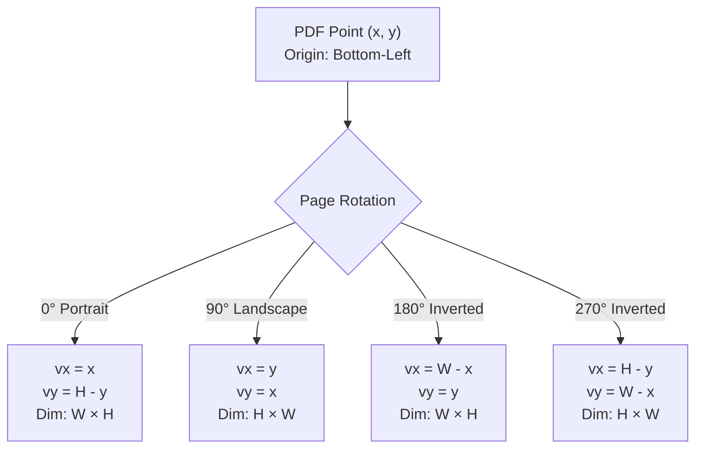

# ADR-0004: Synthetic PDF Engine & Viewport Pipeline

- **Status**: Accepted
- **Date**: 2026-10-07
- **Context**: Robust in-memory test data generation, 4-quadrant orientation mapping, and GPU texture image rendering.

---

## 1. Problem Statement

Automated testing of a PDF reader/editor traditionally suffers from two major pain points:
1. **Flaky External Assets**: Relying on binary PDFs checked into Git or stored on external disks can cause missing file errors, copyright entanglements, or obscure regression diagnosis.
2. **Coordinate System Divergence**: Standard PDF uses a bottom-left Cartesian coordinate system $(0, 0)$ with $y$ growing upwards, while modern screen GUI frameworks (`egui`, HTML Canvas, DirectX, Metal) use a top-left origin $(0, 0)$ with $y$ growing downwards. Introducing arbitrary page rotations (90°, 180°, 270°) compounds this complexity.

---

## 2. In-Memory Synthetic PDF Engine (`SyntheticPdfBuilder`)

Located in `crates/kestrel-core/src/synthetic.rs`, `SyntheticPdfBuilder` provides a fluent, programmatic builder for constructing valid PDF 1.7 documents directly in RAM using `lopdf`.

### Key Synthetic Suites:
1. **Visual Showcase** (`generate_synthetic_visual_showcase_pdf`):
   - Page 1: 0° Portrait with title and metadata.
   - Page 2: 90° Landscape with 3x3 vector grid.
   - Page 3: 180° Inverted Portrait with embedded 16x16 RGB raster image.
   - Page 4: 270° Inverted Landscape with mixed vector shapes and text.
2. **Forms Showcase** (`generate_synthetic_forms_pdf`):
   - Interactive AcroForm with text input (`/Tx`), checkbox (`/Btn`), and dropdown choice (`/Ch`).
3. **Search Corpus** (`generate_synthetic_search_corpus_pdf`):
   - 3-page document with unique keywords, multi-page occurrences, and UTF-8 accented characters (`FACTURACIÓN`).

---

## 3. 4-Quadrant Visual Coordinate Transformation

PDF points $(x, y)$ in bottom-left coordinates within a page of width $W$ and height $H$ map to visual screen coordinates $(vx, vy)$ based on rotation:

For 90° and 270°, the visual dimensions swap: $\text{visual\_width} = H$, $\text{visual\_height} = W$. This transformation is implemented in `kestrel_core::document::map_pdf_point_to_visual()`.

---

## 4. Embedded Raster Image Pipeline

Images embedded as XObjects (`/Subtype /Image`) and invoked via the `Do` operator are handled cleanly:
1. During content stream scanning in `DocumentSession::extract_page_content`, invocations of `/Do` are matched against the page's `/Resources /XObject` dictionary.
2. Filter decompression (FlateDecode, ASCII85Decode) extracts raw RGB or Grayscale bytes.
3. `kestrel_app::app::PdfViewerApp` caches images as `egui::TextureHandle` objects and blits them directly to the hardware viewport during page rendering.
