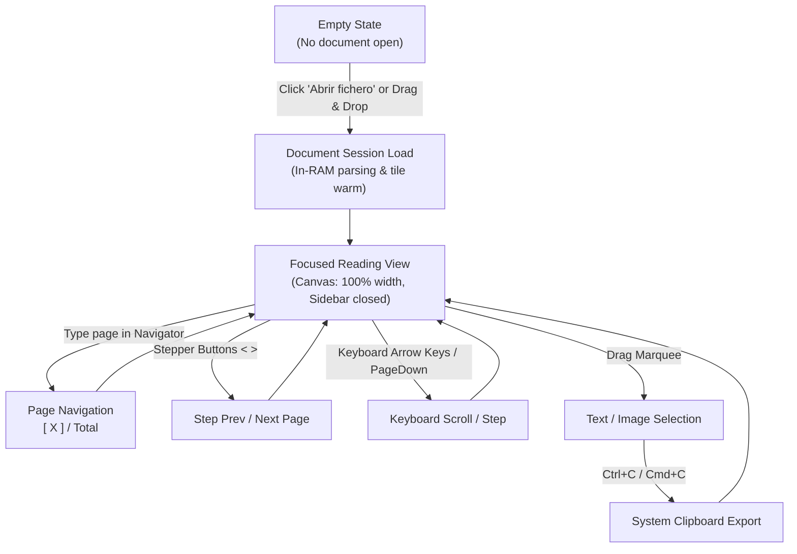

# ADR-0006: UX User Flows, Navigation Model & Document Interaction

- **Status**: Accepted
- **Date**: 2026-10-08
- **Author**: Antigravity (Advanced Agentic Coding)

---

## 1. Executive Summary

This document specifies the end-to-end UX user flows, navigation mechanics, and interactive state transitions for Kestrel-PDF. It establishes how users discover actions, navigate documents, zoom, inspect metadata, and transition between reading, selecting, and editing modes.



---

## 2. Core User Flows

### 2.1 Flow 1: Document Discovery & Onboarding ("Abrir Fichero")

**Goal**: Provide instant, zero-friction access to open a document from any state.

1. **Empty State View**:
   - Clean, centered welcome canvas.
   - Prominent, large primary button: **`[📁] Abrir fichero (Ctrl+O)`** styled in high-contrast warm salmon (`#D97757`).
   - Secondary subtitle: `"o arrastra y suelta tu archivo PDF aquí"`.
   - Keyboard accelerator: Pressing `Ctrl+O` (Windows/Linux) or `Cmd+O` (macOS) triggers the native file picker immediately.
2. **Document Loaded State**:
   - The top toolbar displays a permanent, high-visibility **`[📁] Abrir fichero`** button at the leftmost position.
   - Users never have to dig through nested submenus to open another document.

---

### 2.2 Flow 2: In-Flow Page Navigation ("1 / N")

**Goal**: Seamless, distraction-free page navigation without occupying lateral screen real estate.

```
       [ < ]       [ 1 ]       /       12       [ > ]
    (Prev Page) (Page Input)  (Separator)   (Next Page)
```

1. **Current State Display**:
   - The Page Navigator sits centered in the top toolbar.
   - It displays `[ current_page ] / total_pages` (1-indexed).
2. **Direct Jump by Typing**:
   - User clicks the page number input box (or presses shortcut `Ctrl+G` / `Cmd+G`).
   - The text in the input box is selected.
   - User types the desired page number `X` (e.g. `7`).
   - User presses `Enter` or clicks outside:
     - The input is parsed as a integer.
     - The target page is clamped to `1..=total_pages`.
     - The viewer immediately scrolls to page `X - 1`.
     - The input field synchronizes to `X`.
3. **Step Navigation**:
   - Clicking `[ < ]` decrements the page by 1 (disabled when on page 1).
   - Clicking `[ > ]` increments the page by 1 (disabled when on last page).
4. **Scroll Sync**:
   - When the user scrolls vertically through a multi-page document, the input field updates dynamically to reflect the page currently in view.

---

### 2.3 Flow 3: Distraction-Free Reading Canvas ("PDF As Is")

**Goal**: 100% visual focus on document content.

1. **Sidebar Default Policy**:
   - The left page thumbnails/list sidebar is **hidden by default**.
   - The PDF document occupies the full available width, centered with clean breathing margins.
2. **On-Demand Utility Drawers**:
   - A discreet toggle button `[☰]` allows opening document Outlines/TOC or Form Field lists on-demand when required by advanced workflows.
   - When closed, 0 pixels are wasted on page numbers or redundant titles.

---

### 2.4 Flow 4: Responsive Toolbar Density & Tool Switching

**Goal**: Ensure all primary and secondary tools fit comfortably across varied screen widths without wrapping or visual crowding.

| Cluster | Components | Alignment |
| :--- | :--- | :--- |
| **Primary Actions** | `Abrir fichero` (Salmon CTA) \| `Guardar` \| `Firmar` | Left |
| **Page Navigator** | `[ < ]` `[ X ]` `/ N` `[ > ]` | Center-Left |
| **Zoom & View** | `[-]` `[ Zoom % ]` `[+]` \| `[Ancho]` `[Página]` | Center-Right |
| **Tool Modes** | `[Selección]` `[Mano]` `[Buscar]` | Right |

---

## 3. Keyboard Accelerator Matrix

| Action | macOS | Windows / Linux |
| :--- | :--- | :--- |
| **Abrir fichero** | `Cmd+O` | `Ctrl+O` |
| **Ir a página (Focus Navigator)** | `Cmd+G` | `Ctrl+G` |
| **Página Siguiente** | `Right` / `Down` / `PageDown` | `Right` / `Down` / `PageDown` |
| **Página Anterior** | `Left` / `Up` / `PageUp` | `Left` / `Up` / `PageUp` |
| **Copiar Selección** | `Cmd+C` | `Ctrl+C` / `Ctrl+Ins` |
| **Seleccionar Todo** | `Cmd+A` | `Ctrl+A` |
| **Buscar** | `Cmd+F` | `Ctrl+F` |
| **Ajustar al Ancho** | `Cmd+1` | `Ctrl+1` |
| **Ajustar a Página** | `Cmd+2` | `Ctrl+2` |

---

## 4. Error Prevention & Edge Case Handling

1. **Invalid Page Number Input**:
   - If user types text, negative numbers, or `0`, it safely defaults to `1`.
   - If user types a number greater than `total_pages`, it safely clamps to `total_pages`.
2. **Rapid Key Navigation**:
   - Fast stepping does not cause tile rendering thrash; the render queue prioritizes visible tiles and drops off-screen tasks via LRU eviction.
3. **Shortcuts During Text Editing**:
   - When the user is typing in the Page Navigator text box or search bar, navigation accelerators (e.g. Arrow keys, Space) do not trigger document scrolling.
