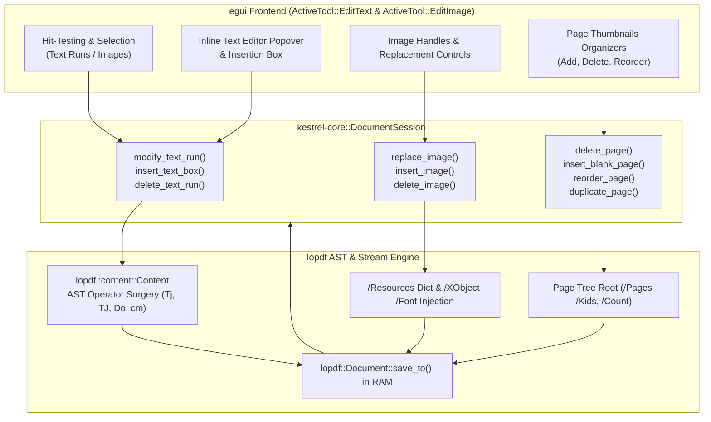

# ADR-0007: In-Place Content Stream Editing, Image Manipulation & Page Tree Mutations

- **Status**: Accepted
- **Date**: 2026-10-08
- **Author**: Antigravity & Core Engineering Team
- **Context**: MVP Roadmap Phase 3 (v0.3.0) — In-Place Text & Image Editing

---

## Context & Problem Statement

Until Phase 2, Kestrel-PDF provided ultra-high-performance viewing, form filling, and cryptographic/visual signing. However, modifying existing documents required external tools. Users need to:
1. Edit existing text runs directly inside the PDF without full-page re-rasterization or loss of vector sharpness.
2. Insert custom text annotations and text boxes with user-defined typography (size, color, position).
3. Manipulate images: replace existing embedded raster images, delete them, or insert new images into any page.
4. Organize document structure: insert blank pages, delete pages, reorder pages, and duplicate pages directly in the viewer.

Prior to this architecture, modifying a PDF in-place without corrupting the cross-reference (`xref`) table, font metrics, or content stream stacks was challenging because PDF is an accumulation format rather than an intuitive document layout model.

---

## Architectural Decisions



### 1. In-Place Text Run Modification & Insertion
- **AST Surgery on Content Streams**: When modifying a text run on `page_index`, `lopdf::content::Content::decode()` parses the page's uncompressed stream into discrete `lopdf::content::Operation`s.
- **Text Replacement**: For existing runs, the operand in `Tj` or `TJ` is replaced with the sanitized new text. In cases where the original font uses an unmapped subset or incompatible encoding, a standard Type 1 `/Helvetica` font is ensured in the page's `/Resources /Font` dictionary, guaranteeing clean rendering across all PDF viewers.
- **Text Box Insertion (`insert_text_box`)**: A dedicated content stream is appended to `/Contents`:
  ```pdf
  q
  BT
  /Helvetica <font_size> Tf
  <r> <g> <b> rg
  1 0 0 1 <x> <y> Tm
  (<escaped_text>) Tj
  ET
  Q
  ```
  This guarantees standard typography without modifying unrelated existing graphical operators.
- **Text Deletion (`delete_text_run`)**: Excises the targeted `Tj`/`TJ` operation from the page's content stream and cleans up surrounding text matrices.

### 2. Image Manipulation & XObject Replacement
- **Replacing Images (`replace_image`)**: Locates the target `VisualImage`'s backing XObject in `Resources /XObject`. Updates its dictionary keys (`/Width`, `/Height`, `/ColorSpace /DeviceRGB`, `/BitsPerComponent 8`, `/Filter /FlateDecode`) and compresses the raw RGB byte buffer with `flate2::write::ZlibEncoder`.
- **Inserting Images (`insert_image`)**: Creates a new Image XObject dictionary, adds it to the document's object store, binds it under a unique name in the page's `/Resources /XObject` sub-dictionary, and appends a `q <w> 0 0 <h> <x> <y> cm /ImName Do Q` operator to `/Contents`.
- **Deleting Images (`delete_image`)**: Strips the `/Do` operator calling the target image XObject from the content stream.

### 3. Page Tree Mutations & Document Organization
- **Page Tree Navigation**: Reads the Catalog dictionary to acquire the root `/Pages` object ID.
- **Page Deletion (`delete_page`)**: Safely removes the page object ID from the parent's `/Kids` array and decrements `/Count`. Rejects deletion if only 1 page remains to protect document validity.
- **Blank Page Insertion (`insert_blank_page`)**: Constructs a clean `Page` dictionary with `/Type /Page`, `/Parent`, `/MediaBox [0, 0, width, height]`, empty `/Resources`, and an empty `/Contents` stream. Inserts the new object ID into `/Kids` at `at_index` and increments `/Count`.
- **Page Reordering (`reorder_page`)**: Swaps or moves indices within `/Kids`.
- **Page Duplication (`duplicate_page`)**: Deep-copies the page dictionary, assigns a new object ID, inserts it adjacent to the source page in `/Kids`, and increments `/Count`.

### 4. Real-Time Session Re-synchronization
- Following any structural or content mutation, `DocumentSession` calls `doc.save_to(&mut output)` directly in RAM.
- `self.raw_bytes` is updated and `DocumentSession::open_from_bytes()` re-evaluates the page layouts, text runs, vector bounds, and page geometries.
- Zero disk roundtrips: all operations happen strictly in memory, maintaining compliance with the synthetic testing invariant.

---

## Consequences

- **Positive**:
  - Full native editing support without requiring heavy external dependencies.
  - Zero rasterization: documents remain pristine vector PDFs.
  - Continuous synchronization with search indexing, visual text layouts, and thumbnails.
- **Trade-offs**:
  - Fonts with proprietary subset encodings fallback to standard Type 1 `/Helvetica` upon editing to guarantee cross-reader portability.
