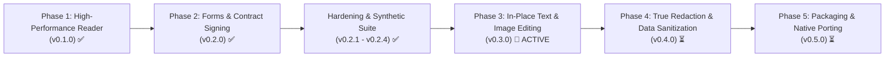

# PLAN-0001: MVP Development Roadmap

- **Status**: Active (Phases 1 & 2 Completed; Phase 3 Next)
- **Target Versions**: v0.1.0 – v0.5.0
- **Authors**: Core Engineering Team & Agents

---

## Phase 1: High-Performance PDF Reader — ✅ COMPLETED (v0.1.0-phase1)
> **Goal**: Build the fastest, smoothest PDF viewer across Windows, Linux, and macOS. Instant startup, continuous 120 FPS scrolling, minimal memory footprint (< 40MB).

### Completed Deliverables:
- Asynchronous tiled rendering pipeline with worker thread pool.
- Bounded LRU cache (< 40MB RAM footprint).
- Continuous scroll, zoom (10%-500%), page thumbnail panel, and outlines.
- Sub-millisecond full-text search and selection layer.

---

## Phase 2: Form Filling & Contract Signing — ✅ COMPLETED (v0.2.0-phase2)
> **Goal**: Allow users to fill legal forms and apply visually and cryptographically valid contract signatures.

### Completed Deliverables:
- **AcroForms Engine**: Interactive text fields, checkboxes, radio buttons, and choice dropdowns with real-time editing.
- **Visual Contract Signing**: Modal signature canvas with Catmull-Rom to Cubic Bézier spline smoothing and stamp placement.
- **PAdES Cryptographic Signing**: SHA-256 digest computation, `/Type /Sig` dictionary embedding conforming to Adobe PAdES standards.

---

## Hardening & Synthetic Suite — ✅ COMPLETED (v0.2.1 – v0.2.4)
> **Goal**: Fortify existing features against diverse real-world edge cases with in-memory synthetic generators.

### Completed Deliverables:
- **Synthetic Data Generator** (`kestrel_core::synthetic::SyntheticPdfBuilder`): Programmatic generation of 4-orientation showcases, interactive forms, and multi-page search corpora.
- **Multi-Filter Decompression**: Chained FlateDecode + ASCII85Decode decompression pipeline.
- **Orientation & Viewport**: 4-quadrant coordinate mapping (0°, 90°, 180°, 270°), dynamic page rotation buttons (`⟲`, `⟳`), responsive Fit Width and Fit Page.
- **Embedded Raster Images**: XObject `/Do` operator extraction and hardware GPU texture rendering.
- **Spanish / UTF-8 Accents**: Preserved accented glyph decoding (`Ó`, `á`, etc.).
- **28-Test Workspace Suite**: 16 integration tests and 12 E2E smoke tests passing on Ubuntu, macOS, and Windows CI.

---

## Phase 3: In-Place Text & Image Editing — ✅ COMPLETED (v0.3.0)
> **Goal**: Enable editing text and modifying images directly inside existing PDFs without rasterizing the whole document.

### Planned Deliverables:
1. **Object Inspection & Selection**:
   - Hit-testing individual text runs, vector paths, and raster image objects.
   - Bounding box transformation handles (move, resize, rotate).
2. **In-Place Text Editing**:
   - In-place text modification for existing text runs in content streams.
   - Font identification, matching, and fallback font embedding.
   - New text box insertion with custom typography (size, weight, color).
3. **Image Manipulation**:
   - Insert new images (PNG, JPEG, WebP).
   - Replace, crop, rotate, or delete existing image XObjects.
   - Deflate/DCT re-compression.
4. **Document Structure Organization**:
   - Reorder, delete, and insert blank or imported pages.

---

## Phase 4: True Redaction & Data Sanitization — ⏳ PLANNED (v0.4.0)
> **Goal**: Provide enterprise-grade data sanitization that permanently destroys sensitive information prior to export.

### Planned Deliverables:
1. **Redaction Selection**: Text search pattern redaction (regex, credit cards, emails) and freeform rectangular area redaction.
2. **True Content Stream Sanitization (AST Surgery)**:
   - Decompress `/Contents` stream.
   - Strip text showing operators (`Tj`, `TJ`, `'`, `"`).
   - Zero out raster pixels intersecting redaction zones in image streams.
   - Purge unreferenced object dictionaries from the cross-reference (`xref`) table.
3. **Metadata & History Scrubbing**:
   - Purge author, edit history, XML `/Metadata` packets, and incremental revision records.

---

## Phase 5: Packaging, WASM Optimization & Native Polish — ⏳ PLANNED (v0.5.0)
> **Goal**: Streamlined installers, WebAssembly Web Worker offloading, and platform-native integration.

### Planned Deliverables:
1. **Native Desktop Installers**: Windows MSI / portable bundle, macOS `.dmg` (Universal binary with code signing), Linux AppImage.
2. **WebAssembly Web Workers**: Offscreen Canvas rendering with multi-worker tile rasterization in browsers.
