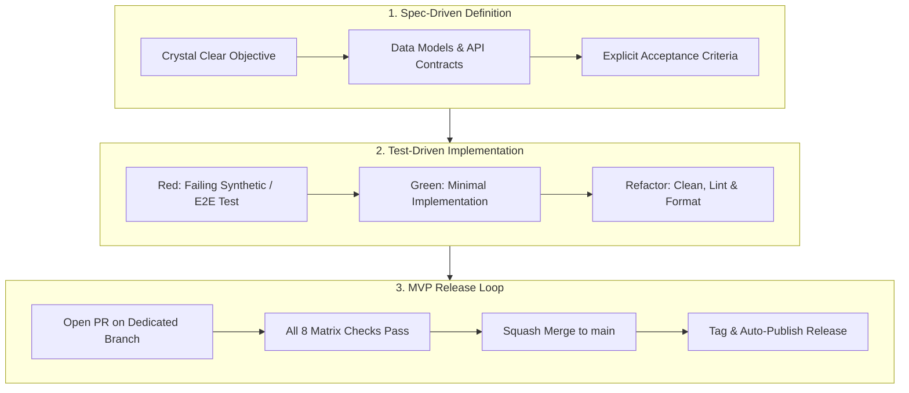

# PLAN-0002: Spec-Driven Development (SDD) & TDD Framework

- **Status**: Active
- **Target**: Universal standard for all agents and contributors
- **Authors**: Antigravity & Engineering Team

---

## 1. Executive Summary

To scale agentic and human development reliably without regressions, Kestrel-PDF operates strictly under **Spec-Driven Development (SDD)** paired with **Test-Driven Development (TDD)** and an **MVP Release Loop** ("fail fast, fix fast").

---

## 2. Spec-Driven Development (SDD) Lifecycle

### Stage 1: Problem Definition & Objective
Before touching code, the agent or engineer must articulate:
1. **The Problem Statement**: What does not work, or what capability is absent?
2. **The Exact Target**: What will the system look like when this task is 100% complete?
3. **Boundaries**: What is explicitly out of scope for this change?

### Stage 2: Interface Contract & Data Models
Document the technical design:
- New Rust structs, enums, or traits.
- Function signatures with input types, return types, and errors.
- UI elements, hotkeys, or canvas interactions (if applicable).

### Stage 3: Acceptance Criteria Matrix
Formulate a checklist of testable criteria. Every criterion must map to an automated test case.

---

## 3. Test-Driven Development (TDD) Execution

### Step 1: Red (Write Failing Test First)
- Write an integration test in `crates/kestrel-core/tests/integration_tests.rs` or an E2E smoke test in `crates/kestrel-app/tests/smoke_test.rs`.
- Use `SyntheticPdfBuilder` to create reproducible PDF fixtures programmatically.
- Run `cargo test` and confirm that the test fails for the expected reason (compilation stub or assertion failure).

### Step 2: Green (Minimal Implementation)
- Write the simplest, cleanest implementation in `kestrel-core` or `kestrel-app` to satisfy the test.
- Re-run `cargo test` until the test passes.

### Step 3: Refactor (Polish & Hardening)
- Refactor the code for clarity, performance, and memory efficiency.
- Ensure zero warnings: `cargo clippy --workspace --all-targets -- -D warnings`.
- Format code: `cargo fmt --all -- --check`.
- Re-run the full test suite: `cargo test --workspace`.

---

## 4. The MVP Release Loop: "Fail Fast, Fix Fast"

During the MVP development phase:
1. **Single Feature / Fix Branch**: Work is isolated on `feat/<name>` or `fix/<name>`.
2. **Pull Request**: Submitted non-interactively via `gh pr create` with automated CI matrix validation (Ubuntu, Windows, macOS, WASM).
3. **Immediate Merge & Release**: Once CI passes, squash-merge into `main`, tag the commit (`vX.Y.Z`), and push the tag.
4. **Binary Availability**: GitHub Actions builds native binaries for Windows (`.exe`), macOS, and Linux, publishing the release immediately for user download and validation.
