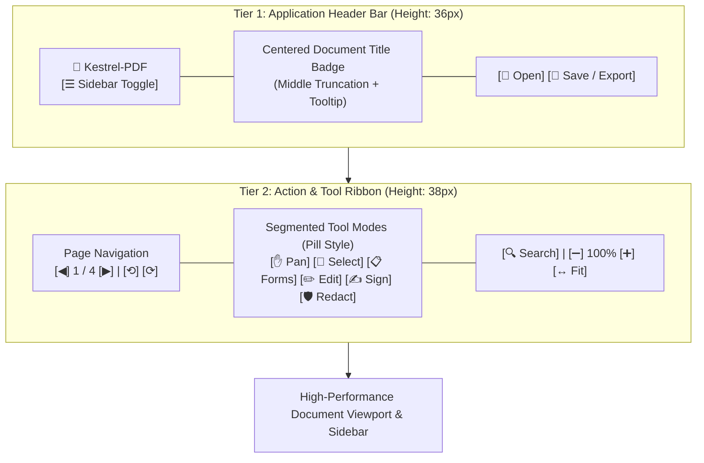

# PLAN-0005: Responsive Toolbar Architecture & PDF Reader UX Redefinition

- **Target Version**: v0.2.9
- **Author**: Antigravity Pair Programmer
- **Status**: Active
- **Date**: 2026-10-07

---

## 1. Problem Statement & Root Cause Analysis

### 1.1 The Crowding Defect ("Botones Apiñados")
In `kestrel-app::app::render_ui`, the top toolbar was previously rendered inside a single `egui::TopBottomPanel::top("top_toolbar")` with a single horizontal layout containing over 20 disparate controls:
- Full document heading (`ui.heading(self.title_bar_text())`)
- File operations (`Open`, `Save`)
- 6 interactive tool buttons (`Pan`, `Select`, `Forms`, `Edit Text`, `Sign Contract`, `Redact`)
- Search input bar and `Find` button
- Right-to-left layout containing zoom controls (`Zoom In`, `Zoom Out`, `100%`, `Fit Page`, `Fit Width`, `Reset`), rotation (`⟲`, `⟳`), and page navigation (`Prev`, `Page N / M`, `Next`).

When a document has a long filename (e.g. `Certificado_de_Instalacion_Electrica_de_Baja_Tension_2026_Final_Firmado.pdf`), the heading consumes hundreds of horizontal pixels. Because all controls share a single horizontal row with conflicting left-to-right and right-to-left alignment, the controls collide, squish together, or wrap unpredictably.

---

## 2. UX Best Practices for Professional PDF Readers

Benchmarking against industry leaders (**Apple Preview**, **Adobe Acrobat Modern UI**, **PDF Expert**, **Edge PDF Viewer**, **SumatraPDF**):



### Key UX Design Principles:
1. **Decoupling Metadata from Actions (2-Tier Architecture)**:
   - **Tier 1 (Header Bar)**: Dedicated to document identity and system actions. Filename length never impacts or constrains the tool buttons.
   - **Tier 2 (Toolbar Ribbon)**: Dedicated strictly to interacting with and navigating the document.
2. **Middle-Ellipsis Filename Truncation with Full Tooltip**:
   - Rather than clipping off the end (which loses the `.pdf` extension and version/revision tags), filenames longer than 40 characters are truncated in the middle:
     `Certificado_de_Instala…_Firmado.pdf`
   - Hovering displays the full filename, path, page count, and dimensions.
3. **Cognitive Chunking into Visual Clusters**:
   - **Navigation Cluster**: `[◀]` `Page X of Y` `[▶]` + Rotation controls.
   - **Interactive Mode Cluster**: Segmented pill buttons with visual active state.
   - **Search Cluster**: Quick search input with shortcut hint (`Enter` to search).
   - **Display Cluster**: Zoom stepper (`[-] 100% [+]`), `Fit Width`, `Fit Page`.
4. **Accessible Hit Targets & Visual Polish**:
   - Consistent button heights ($28\text{ px}$ interactive targets).
   - Segmented control styling for active tools.
   - Subtle background separation between Header and Toolbar.

---

## 3. Technical Implementation Specification

### 3.1 Filename Middle Truncation Helper
```rust
pub fn truncate_filename_middle(name: &str, max_len: usize) -> String {
    if name.chars().count() <= max_len || max_len < 10 {
        return name.to_string();
    }
    let chars: Vec<char> = name.chars().collect();
    let keep_front = (max_len - 3) / 2;
    let keep_back = max_len - 3 - keep_front;
    let front: String = chars[..keep_front].iter().collect();
    let back: String = chars[chars.len() - keep_back..].iter().collect();
    format!("{}…{}", front, back)
}
```

### 3.2 UI Structure in `kestrel-app::app::render_ui`
- Replace single monolithic `TopBottomPanel::top("top_toolbar")` with:
  1. `TopBottomPanel::top("app_header")`:
     - Height: $\sim 36\text{ pt}$.
     - Left: Sidebar toggle (`ui.selectable_label(self.sidebar_open, "☰ Sidebar")`), App logo `🦅 Kestrel PDF`.
     - Center: Centered title pill with middle truncation and `.on_hover_text(full_name)`.
     - Right: `[📂 Open]`, `[💾 Save / Export]` (if document loaded).
  2. `TopBottomPanel::top("action_toolbar")`:
     - Height: $\sim 38\text{ pt}$.
     - Left: Page Navigation (`Prev`, `Page N / Total`, `Next`, `Rotate Left`, `Rotate Right`).
     - Center / Middle: Segmented mode selector (`Pan`, `Select`, `Forms`, `Edit`, `Sign`, `Redact`).
     - Right: Search input & button + Zoom Stepper (`-`, `100%`, `+`, `Fit Width`, `Fit Page`).

---

## 4. Test-Driven Development (TDD) Strategy

- **Test 1 (`test_e2e_toolbar_responsive_layout_with_ultra_long_filename`)**:
  - Load a document with an extreme 120-character filename:
    `"Very_Long_Comprehensive_Enterprise_Contract_Specification_Document_With_Customer_Identifier_And_Revision_Metadata_2026_Final.pdf"`
  - Verify that both header and action toolbar render properly without panics or clipping.
  - Verify that the rendered UI contains navigation buttons (`Prev`, `Next`), all 6 tool buttons (`Pan`, `Select`, `Forms`, `Edit`, `Sign`, `Redact`), and zoom controls.
  - Verify middle truncation preserves the `.pdf` extension and displays a tooltip.
- **Test 2 (`test_e2e_two_tier_toolbar_interaction_and_tool_switching`)**:
  - Verify clicking tool buttons in the dedicated toolbar ribbon cleanly updates `app.active_tool` and renders distinct visual shapes.
- **Test 3 (Regression & Pre-flight)**:
  - Run the entire 35-test workspace suite (`cargo test --workspace`).
  - Run `cargo fmt`, `cargo clippy`, and WASM build check.

---

## 5. Acceptance Criteria

- [ ] Filenames of arbitrary length (from 1 char to 200+ chars) never crowd, overlap, or squish action buttons.
- [ ] Document title is centered and displays middle truncation with full tooltip on hover.
- [ ] Two-tier toolbar cleanly separates App/File metadata from Document Tools & Navigation.
- [ ] Tool selector behaves as a cohesive segmented control with visual active indicators.
- [ ] All existing and new automated tests pass with 0 warnings.
