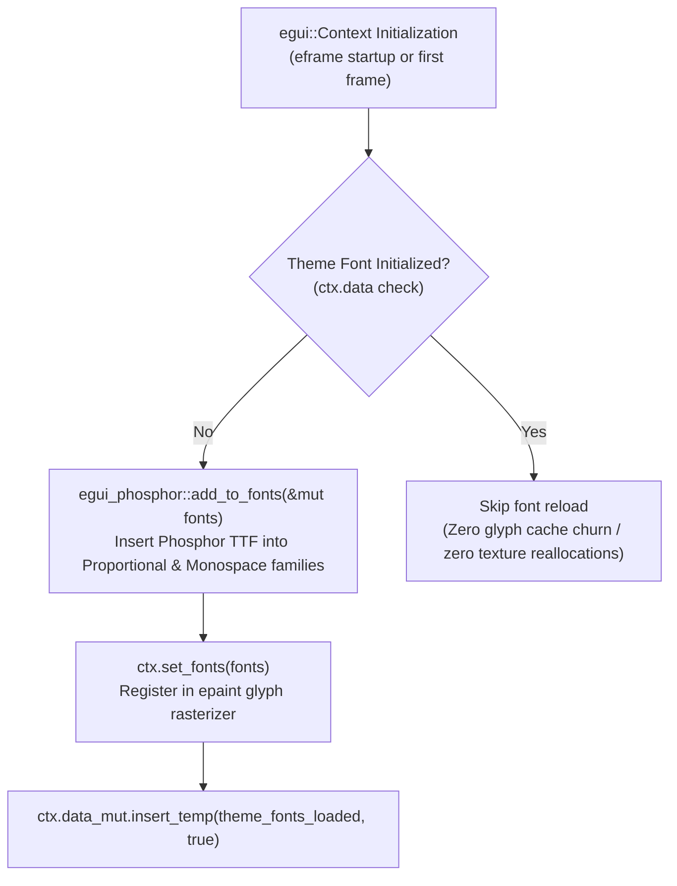

# PLAN-0012: Phosphor Icon Font Integration & Universal Glyph Rendering Fidelity

- **Target Version**: v0.2.16
- **Author**: Antigravity (AI Pair Programmer)
- **Status**: Completed
- **Date**: 2026-10-08

---

## 1. Objective & Problem Statement

### 1.1 The Issue
Buttons, titles, and controls throughout the application currently reference Unicode emojis (e.g., `🦅`, `📂`, `💾`, `✍️`, `✋`, `📝`, `📋`, `✏️`, `🛡️`, `➕`, `➖`, `🔍`, `🔒`, `🗑`) and geometric Unicode symbols (e.g., `◀`, `▶`, `⟲`, `⟳`).

Because `egui` bundles only `Ubuntu-Light.ttf` and `Hack-Regular.ttf` in its default font definitions, it has **zero glyph support** for emoji code points and incomplete coverage for certain mathematical / directional symbols. As a result, users on desktop (Linux, Windows, macOS) and WebAssembly experience:
- Broken missing-glyph rectangles ("tofu" boxes / `▯`) or question marks in place of icons.
- Unprofessional visual rendering on primary CTAs (`"📂 Abrir fichero"`, `"✍️ Sign Contract"`, `"🦅 Kestrel-PDF"`).
- Distorted or missing arrow glyphs in page navigation steppers (`[ ◀ Prev ]`, `[ Next ▶ ]`) and rotation controls (`[ ⟲ ]`, `[ ⟳ ]`).

### 1.2 The Solution
Integrate the official `egui-phosphor` vector icon font into Kestrel-PDF's font pipeline:
1. Bundle the Phosphor icon TrueType font in the application binary via `egui-phosphor` (v0.7.3, which matches `egui` 0.29.1).
2. Register the Phosphor font definition into `egui::FontDefinitions` automatically within `Theme::apply(ctx)` with an idempotent single-initialization guard.
3. Establish a semantic icon module (`crate::icons` or `Theme::icons`) providing high-level, semantic icon constants (`APP_LOGO`, `OPEN_FILE`, `SAVE_FILE`, `PREV_PAGE`, `NEXT_PAGE`, `TOOL_SIGN`, `ROTATE_CCW`, `ROTATE_CW`, etc.).
4. Replace all raw emoji and unsupported Unicode literals in `app.rs` with clean semantic Phosphor icons.
5. Guarantee 100% vector glyph rendering fidelity across Windows, macOS, Linux, FreeBSD, and WebAssembly with zero host-OS font dependencies.

---

## 2. Technical Architecture & Font Integration Contract

### 2.1 Font Injection Pipeline

### 2.2 Semantic Icon Mapping Table

| UI Component | Previous (Broken) | Phosphor Semantic Icon | Icon Constant |
| :--- | :--- | :--- | :--- |
| **Brand Logo (Header)** | `🦅 Kestrel-PDF` | Phosphor Bird vector | `icons::APP_LOGO` (`BIRD`) |
| **Empty State Hero** | `🦅` (48px) | Phosphor Bird vector | `icons::APP_LOGO` (`BIRD`) |
| **Open File CTA** | `📂 Abrir fichero` | Phosphor Open Folder | `icons::OPEN_FILE` (`FOLDER_OPEN`) |
| **Save / Export CTA** | `💾 Save / Export` | Phosphor Floppy Disk | `icons::SAVE_FILE` (`FLOPPY_DISK`) |
| **Page Stepper (Prev)** | `◀ Prev` | Phosphor Caret Left | `icons::PREV_PAGE` (`CARET_LEFT`) |
| **Page Stepper (Next)** | `Next ▶` | Phosphor Caret Right | `icons::NEXT_PAGE` (`CARET_RIGHT`) |
| **Rotate Counter-Clockwise** | `⟲` | Phosphor Arrow CCW | `icons::ROTATE_CCW` (`ARROW_COUNTER_CLOCKWISE`) |
| **Rotate Clockwise** | `⟳` | Phosphor Arrow CW | `icons::ROTATE_CW` (`ARROW_CLOCKWISE`) |
| **Pan Tool** | `✋ Pan` | Phosphor Hand Palm | `icons::TOOL_PAN` (`HAND_PALM`) |
| **Select Text Tool** | `📝 Select` | Phosphor Text Cursor | `icons::TOOL_SELECT` (`CURSOR_TEXT`) |
| **Form Fill Tool** | `📋 Forms` | Phosphor Textbox | `icons::TOOL_FORMS` (`TEXTBOX`) |
| **Edit Text Tool** | `✏️ Edit Text` | Phosphor Pencil | `icons::TOOL_EDIT_TEXT` (`PENCIL_SIMPLE`) |
| **Sign Contract Tool** | `✍️ Sign Contract` | Phosphor Signature | `icons::TOOL_SIGN` (`SIGNATURE`) |
| **Redact Tool** | `🛡️ Redact` | Phosphor Shield | `icons::TOOL_REDACT` (`SHIELD`) |
| **Copy Text** | `Copy Text` | Phosphor Copy | `icons::COPY_TEXT` (`COPY`) |
| **Copy Image** | `Copy Image` | Phosphor Image | `icons::COPY_IMAGE` (`IMAGE`) |
| **Zoom Steppers** | `➕`, `➖` | Phosphor Plus / Minus | `icons::ZOOM_IN`, `icons::ZOOM_OUT` |
| **Search / Find** | `🔍`, `Find` | Phosphor Magnifying Glass | `icons::SEARCH` |
| **Toast Status Badge** | `ℹ` | Phosphor Info Circle | `icons::INFO` |
| **Toast Dismiss** | `✖` | Phosphor X | `icons::CLOSE` |
| **Sidebar Toggle** | `◀ Cerrar panel` | Phosphor Sidebar Simple | `icons::SIDEBAR` |
| **Add Form Field** | `➕ Add Form Field` | Phosphor Plus | `icons::ADD` |
| **Signature Pad Clear** | `🗑 Clear Pad` | Phosphor Trash | `icons::TRASH` |
| **Signature Pad Undo** | `↩ Undo` | Phosphor Arrow U-Turn | `icons::UNDO` |
| **PAdES Security** | `🔒 PAdES Metadata` | Phosphor Lock | `icons::LOCK` |
| **Adopt Signature** | `✅ Adopt & Place` | Phosphor Check Circle | `icons::CHECK` |

---

## 3. Implementation Phases

- **Phase 1: Dependency & Font System**:
  - Add `egui-phosphor = "0.7.3"` to `crates/kestrel-app/Cargo.toml`.
  - Update `Theme::apply(ctx)` in `crates/kestrel-app/src/theme.rs` to configure Phosphor icon fonts with idempotent caching.
  - Create `crates/kestrel-app/src/icons.rs` with semantic icon constants.
- **Phase 2: App Surface Upgrade**:
  - Replace broken unicode emojis in `crates/kestrel-app/src/app.rs` with `icons::*`.
  - Verify layout spacing and button padding with the new icon glyphs.
- **Phase 3: Verification & TDD**:
  - Update `smoke_test.rs` to verify Phosphor font registration and icon rendering.
  - Run full test matrix: `cargo fmt`, `cargo clippy`, `cargo test`, `cargo check wasm32`.
- **Phase 4: Release Lifecycle**:
  - Open PR on GitHub, verify CI matrix across Linux/macOS/Windows/WASM, merge, and release v0.2.16.

---

## 4. Acceptance Criteria

1. **Zero Tofu / Missing Glyphs**: All icons render as clean, scalable vector glyphs without rectangular fallback boxes or missing character artifacts.
2. **Self-Contained TrueType Embedding**: No runtime dependencies on host operating system fonts.
3. **Zero Texture Churn**: Fonts are registered once per `Context` without invalidating the font atlas every frame.
4. **Full Test Compatibility**: All existing smoke tests (`contains("Prev")`, `contains("Next")`, `contains("Abrir fichero")`, `contains("Sign Contract")`) continue to pass.
5. **Universal Portability**: Zero warnings on `wasm32-unknown-unknown`, MSVC, macOS Apple Silicon, and Linux GNU.
