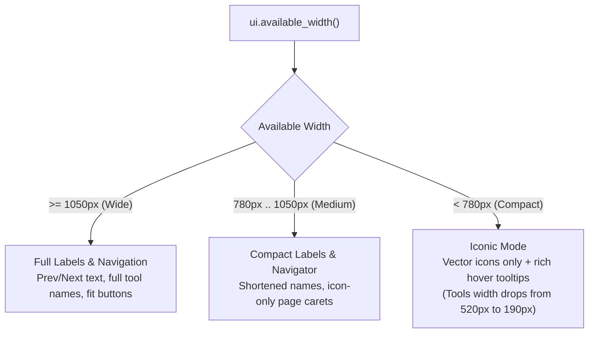

# PLAN-0013: Borderless Modern UI & Adaptive Responsive Toolbar Architecture

- **Target Version**: v0.2.17
- **Author**: Antigravity (AI Pair Programmer)
- **Status**: Completed
- **Date**: 2026-10-08

---

## 1. Objective & Problem Statement

### 1.1 The Issue
User feedback highlights two critical visual and ergonomic pain points:
1. **Excessive Borders & Visual Cramping ("Tiene muchos bordes... no respiran")**:
   - The UI wraps almost every element in harsh 1px borders (`BORDER_DARK` / Slate 700): `header_frame`, `ribbon_frame`, `pill_frame`, `secondary_button`, `segmented_tool_button`, and explicit `ui.separator()` vertical strokes.
   - This "box inside a box inside a box" aesthetic creates visual noise, makes buttons look boxed in, and starves interactive controls of breathing room and comfortable whitespace.
2. **Lack of Viewport Responsiveness ("No es 100% responsive... cuando no está a ventana completa, los botones se apiñan")**:
   - In non-maximized or half-screen windows (e.g., width 700px–1000px), the toolbar buttons crowd into each other and collide with right-aligned zoom/search widgets.
   - All tool labels (`Pan`, `Select`, `Forms (N)`, `Edit Text`, `Sign Contract`, `Redact`) and navigation labels (`Prev`, `Next`) are statically wide (~1150px total minimum row width), with zero adaptive collapsing when available horizontal width shrinks.

### 1.2 The Solution
1. **Borderless & Soft Visual Redefinition ("Airy Modernism")**:
   - Eliminate hard 1px strokes from idle secondary buttons and segmented tool items. Inactive states are clean, borderless, with transparent or subtle surface tints.
   - Transform `pill_frame` into a soft, borderless container (`Stroke::NONE`) with gentle rounding, letting the Warm Salmon active tool stand out cleanly without competing border cages.
   - Soften separators into subtle 16px vertical dividers with gentle alpha opacity, or generous whitespace.
   - Increase button padding and spacing so controls breathe with comfortable hit areas.
2. **Adaptive Responsive Toolbar Engine**:
   - Introduce responsive layout breakpoints based on `ui.available_width()`:
     - **Wide Viewport (`avail_w >= 1050.0`)**: Full icon + label (`[✋ Pan] [📝 Select] [📋 Forms] [✏️ Edit Text] [✍️ Sign Contract] [🛡️ Redact]`), full page steppers (`[< Prev] 1 / N [Next >]`), full zoom steppers and reset.
     - **Medium Viewport (`780.0 <= avail_w < 1050.0`)**: Compact labels (`[✋ Pan] [📝 Select] [📋 Forms] [✏️ Edit] [✍️ Sign] [🛡️]`), compact navigator (`[<] 1 / N [>]`).
     - **Compact Viewport (`avail_w < 780.0`)**: Iconic tools with rich tooltips (`[✋] [📝] [📋] [✏️] [✍️] [🛡️]`), compact zoom steppers (`[-] 100% [+] [Fit]`), compact navigator.
     - **Header Tier 1 Responsive Adaptation**: Truncates document filename dynamically to available header space, and compacts open/save action labels when horizontal space is constrained.

---

## 2. Technical Architecture & Responsive Design

### 2.1 Responsive Ribbon Flow

### 2.2 Visual Hierarchy & Border Elimination Matrix

| Component | Previous Style (Heavy) | New Style (Borderless & Airy) |
| :--- | :--- | :--- |
| **Ribbon Container** | Full 4-sided `BORDER_DARK` 1px stroke | Subtle bottom border only (`Color32::from_white_alpha(15)`), no box border |
| **Pill Frames** | `fill(PANEL_DARK).stroke(1.0, BORDER_DARK)` | Soft subtle fill, `Stroke::NONE`, smooth rounding |
| **Tool Buttons (Inactive)**| `fill(PANEL_DARK).stroke(1.0, BORDER_DARK)` | Borderless transparent fill, soft hover highlight |
| **Tool Buttons (Active)**  | `fill(ACCENT_SALMON).stroke(1.5, ...)` | Solid Warm Salmon pill, `Stroke::NONE` or subtle soft highlight |
| **Secondary Buttons**     | `stroke(1.0, BORDER_DARK)` | Borderless, comfortable padding, soft hover glow |
| **Dividers**              | Harsh full-height `ui.separator()` | Soft subtle vertical divider or clean spacing |

---

## 3. Implementation Phases

- **Phase 1: Visual Tokens & Theme Modernization (`crates/kestrel-app/src/theme.rs`)**:
  - Update `secondary_button`, `segmented_tool_button`, and `pill_frame` to eliminate harsh strokes.
  - Soften global `Visuals::dark()` widget strokes.
- **Phase 2: Responsive Ribbon & Header Engine (`crates/kestrel-app/src/app.rs`)**:
  - Implement responsive tier mode detection based on `ui.available_width()`.
  - Adapt tool button labels, navigation steppers, zoom actions, and header buttons to screen width.
- **Phase 3: Automated Verification & Responsive Tests (`smoke_test.rs`)**:
  - Add test verifying responsive collapse at narrow window width (e.g. 700px) and full layout at wide desktop width (1280px).
  - Verify all 55 existing integration and smoke tests continue passing.
- **Phase 4: Release & Documentation**:
  - Update `frontend` skill instructions in `.agents/skills/frontend/SKILL.md`.
  - Build, PR, CI validation, and release v0.2.17.

---

## 4. Acceptance Criteria

1. **Zero Harsh Boxed-In Aesthetics**: No double- or triple-nested borders; buttons feel lightweight, modern, and spacious.
2. **100% Responsive Non-Fullscreen Usability**: Resizing the application down to 700px–800px causes zero overlapping, crowding, or clipped controls.
3. **Rich Discoverability**: In compact mode, all icon-only buttons provide instant, descriptive tooltips with keyboard shortcut hints.
4. **All Tests Pass**: 100% of headless smoke tests and synthetic integration tests pass with zero clippy or rustfmt warnings.
