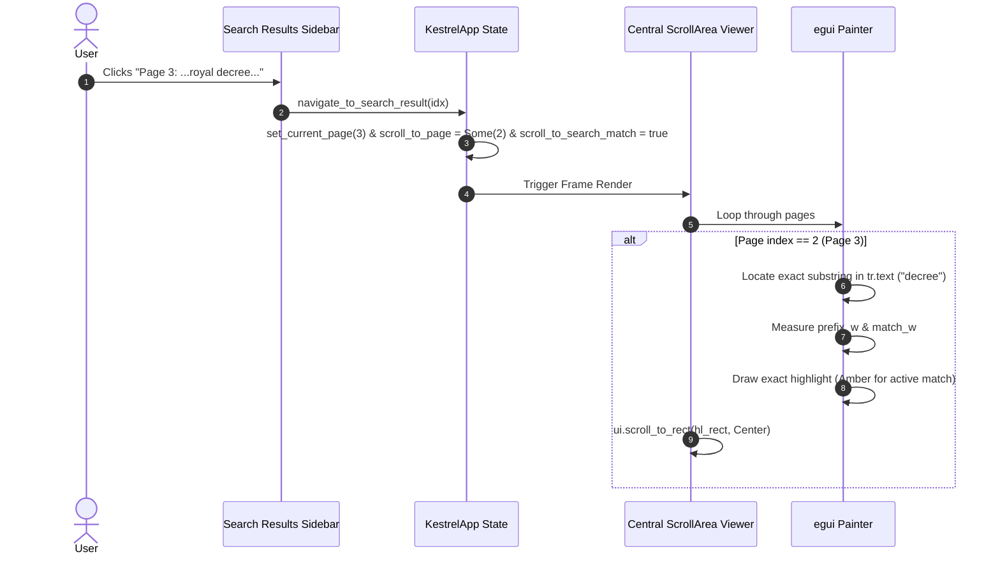

# PLAN-0014: Search Result Navigation & Exact Text Highlighting Engine

- **Target Version**: v0.2.18
- **Author**: Antigravity (AI Pair Programmer)
- **Status**: In Progress
- **Date**: 2026-10-08

---

## 1. Executive Summary & Problem Statement

Users reported two critical usability regressions when utilizing Kestrel-PDF's search capabilities:
1. **Broken Search Result Navigation in Sidebar**:
   When performing a search, matching results appear in the sidebar under `SidebarTab::SearchResults`. However, clicking on any result card (`Page X: ...`) did not scroll or move the document viewport to the target page or match location. The document remained static, giving the impression that clicking does nothing.
2. **Whole Paragraph Over-Highlighting**:
   When a search term was matched inside a text run (`TextRun`), Kestrel-PDF highlighted the visual bounding box of the entire text run or paragraph (`layout.text_run_visual_bounds(tr, page_rot)`), rather than highlighting only the exact matched word/characters.

---

## 2. Requirements & Specification

### Requirement 1: Programmatic Scroll Navigation on Search Result Click & Sidebar Selection
- When a user clicks a search result in the sidebar (`SidebarTab::SearchResults`):
  1. The selected match index (`selected_search_result`) must be updated.
  2. `current_page` must be synchronized to `res.page_index + 1`.
  3. `page_input_text` must update to reflect `res.page_index + 1`.
  4. The continuous central viewer (`egui::ScrollArea::both()`) must programmatically scroll to center or display the target page / match location using `response.scroll_to_me(Some(egui::Align::TOP))` or `ui.scroll_to_rect(match_rect, Some(egui::Align::Center))`.
  5. The selected search result card in the sidebar must have visual feedback (active accent styling vs secondary button).
  6. The status toast should confirm navigation: `"Navigated to search match on Page X"`.
- Similar navigation must also be wired for `SidebarTab::Thumbnails` and `SidebarTab::Outlines` via a shared `go_to_page` helper, ensuring all sidebar navigation scrolls smoothly.

### Requirement 2: Exact Substring / Word Visual Highlighting
- Instead of highlighting the entire `TextRun` bounding box, the highlight engine must calculate the exact visual bounding box for each occurrence of `search_query` within `tr.text`.
- For horizontal text:
  - Measure `prefix_w` (width of text preceding the match) and `match_w` (width of the matched text) using egui's proportional font measurement (`painter.layout_no_wrap`).
  - Render a rounded highlight rectangle bounded by `[t_x + prefix_w - 1.5, t_y - 1.0]` to `[t_x + prefix_w + match_w + 1.5, t_y + font_size * 1.15 + 1.0]`.
- For rotated text:
  - Rotate the 4 corners along the baseline direction `(cos(angle), sin(angle))` and perpendicular `(-sin(angle), cos(angle))`, drawing a convex polygon shape matching the text rotation.
- Visual token distinction:
  - Active/selected match on the current page: Warm Amber/Orange (`Color32::from_rgba_unmultiplied(251, 146, 60, 210)`).
  - Other search matches: Sunny Yellow (`Color32::from_rgba_unmultiplied(254, 240, 138, 180)`).
- Multiple occurrences within the same line or paragraph must each receive distinct exact highlights.

---

## 3. Architecture & Data Flow

---

## 4. Test Strategy (TDD)

1. **Integration / E2E Smoke Tests (`crates/kestrel-app/tests/smoke_test.rs`)**:
   - `test_e2e_search_navigation_scroll_and_page_synchronization`:
     Load a multi-page document, execute a search across pages, click the second result, verify `current_page`, `page_input_text`, and `scroll_to_page` / `scroll_to_search_match` are updated.
   - `test_e2e_exact_word_search_highlight_bounds_not_whole_paragraph`:
     Construct a text run with a long sentence, search for a single word, verify that the rendered highlight rect width matches only the query word width and does not span the entire text run width.
2. **Regression Testing**:
   - Ensure all existing 57 tests pass with zero regressions.
