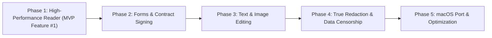

# Kestrel-PDF: MVP Development Roadmap

This roadmap defines the implementation trajectory for Kestrel-PDF, emphasizing high-performance delivery, rigorous benchmarks, and strict modularity.

---

## Phase 1: High-Performance PDF Reader (MVP Core Foundation)
> **Goal**: Build the fastest, smoothest PDF viewer on Windows. Instant startup (< 100ms), continuous 120 FPS scrolling, minimal memory footprint (< 40MB).

### Deliverables & Milestones:
1. **Engine Scaffolding & PDFium Binding**:
   - Integrate PDFium runtime with memory-mapped (`mmap`) file loading.
   - Page geometry, media box, and rotation handling.
2. **Asynchronous Tiled Rendering Pipeline**:
   - Worker thread pool for offscreen rasterization.
   - Virtualized viewport with double-buffered rendering to prevent visual flickering.
   - Predictive pre-fetching: Rasterize $\pm 2$ pages ahead of scroll direction.
   - Bounded LRU bitmap cache with memory limits (e.g. max 150MB).
3. **Viewport & Navigation UI**:
   - Continuous scroll, single-page view, and two-page spread.
   - Smooth zoom (pinch, Ctrl+Wheel, fit-to-width, fit-to-height, arbitrary percent 10%-1000%).
   - Page thumbnails and table-of-contents (PDF Outlines) panel.
4. **Text Layer & Search**:
   - Glyph bounding box extraction for text selection.
   - Native clipboard copy (preserving line breaks and whitespace).
   - Fast full-text search with instant highlight navigation.
5. **Phase 1 Acceptance Criteria**:
   - Opens a 1,000-page complex PDF in $< 120\text{ ms}$.
   - Frame rate stays at 60-120 FPS during rapid continuous mouse wheel scrolling.
   - Baseline memory consumption $< 45\text{ MB}$.

---

## Phase 2: Form Filling & Contract Signing - ✅ COMPLETED (v0.2.0-phase2)
> **Goal**: Allow users to fill legal & government forms and execute visually and cryptographically valid contract signatures.

### Deliverables & Milestones:
1. **AcroForms Interactive Engine**:
   - Detect and render interactive form widgets (text fields, checkboxes, radio buttons, combo/choice boxes).
   - Sidebar Forms panel with direct input and real-time field progress tracking.
   - Form field data validation and document state persistence.
2. **Visual Contract Signing**:
   - Signature creation modal: Draw with stylus/mouse on a dedicated smooth canvas.
   - Cubic Bézier smoothing algorithm for fluid ink strokes.
   - Stamp placement tool: Resize, reposition, and flatten signature onto target page.
3. **PAdES / PKCS#7 Cryptographic Signing**:
   - Compute SHA-256 digest over PDF document binary content.
   - Embed digital signature dictionary (`/Sig`) with signer name, reason, location, and timestamp conforming to Adobe PAdES standards.
   - Verified via automated Testing Trophy integration and E2E smoke tests.

---

## Phase 3: In-Place Text & Image Editing
> **Goal**: Enable editing text and modifying images directly inside existing PDFs without rasterizing the whole document.

### Deliverables & Milestones:
1. **Object Inspection & Selection**:
   - Select individual text runs, path vectors, and image objects.
   - Bounding box transformation handles (move, resize, rotate).
2. **Text Editing**:
   - In-place text modification for existing text runs.
   - Font identification and matching (or embedded font fallback).
   - Insert new text boxes with custom typography (font family, size, weight, color, alignment).
3. **Image Manipulation**:
   - Insert new images (PNG, JPEG, WebP) with alpha transparency.
   - Replace, crop, rotate, or delete existing image objects.
   - Re-compression using standard Deflate / DCTDecode to prevent file bloat.
4. **Document Structure Management**:
   - Rotate, reorder, delete, and insert blank/external pages.

---

## Phase 4: True Redaction & Data Censorship
> **Goal**: Provide enterprise-grade data sanitization that permanently destroys sensitive information prior to export.

### Deliverables & Milestones:
1. **Redaction Selection Tool**:
   - Text redaction (highlighting names, social security numbers, bank IBANs, or regex pattern matching).
   - Area redaction (drawing a bounding box over photos, stamps, or barcodes).
   - Visual preview with configurable redaction styles (blackout, whiteout, custom redaction codes).
2. **True Content Stream Sanitization (AST Surgery)**:
   - Decompress `/Contents` stream.
   - Parse PDF graphics state operators and strip text showing operators (`Tj`, `TJ`, `'`, `"`).
   - Re-rasterize and zero out intersecting image byte regions in the stream.
   - Strip deleted objects and prune orphan dictionaries from the cross-reference (`xref`) table.
3. **Metadata & History Scrubbing**:
   - Remove author, creation dates, application IDs, and embedded XML `/Metadata` packets.
   - Flatten annotations and remove prior incremental update revisions.

---

## Phase 5: Cross-Platform (macOS Port & Polish)
> **Goal**: Deliver the native macOS experience matching the Windows benchmark.

### Deliverables & Milestones:
1. **macOS Graphics & Shell Integration**:
   - Metal-accelerated rasterization blitter.
   - Native trackpad pinch-to-zoom and momentum scrolling.
   - Apple Silicon (M-series) NEON SIMD optimizations.
2. **Keychain & macOS Certificate Integration**:
   - Apple Keychain integration for cryptographic signing certificates.
3. **Final Performance Profiling & Packaging**:
   - Windows installer (MSI / portable `.exe`) with code signing.
   - macOS `.dmg` / notarized Universal binary (Apple Silicon + Intel).
